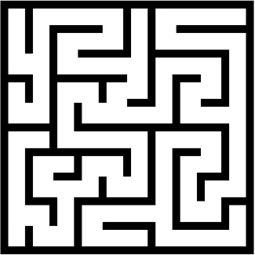

<!-- PROJECT LOGO -->
<br />
<div align="center">
  <a href="https://github.com/slacey21/maze_solver">
    
  </a>

<h3 align="center">maze_solver</h3>

  <p align="center">
    Create and solve mazes of varying difficulty using Python and the Tkinter library.
    <br />
    <a href="https://github.com/slacey21/maze_solver/media/usage.gif">View Demo</a>
  </p>
</div>

## Description
This maze solver creates a maze of varying difficulty depending on user input. Then, using a BFS searching algorithm, navigates the maze until successfully reaching the end.

## Installation
1. Clone the repo
```ssh
git clone https://github.com/slacey21/maze_solver
```
2. From the command line, run the `main.py` file along with an optional flag to indicate the difficulty of the maze (medium is default difficulty).
```ssh
python main.py [-emh]
```
  * Difficulty Flags:
  - `-e`: Easy difficulty, creates 6 x 6 grid of cells as base for maze
  - `-m`: Medium difficulty (default if no arg provided), creates 12 x 12 grid of cells as base for maze
  - `-h`: Hard difficulty, creates 18 x 18 grid of cells as base for maze

## Preview
<div align="center">
  <h3 align="center">Maze Solver at Work</h3>
  
</div>

## License
<a href="license.txt">MIT License</a>

